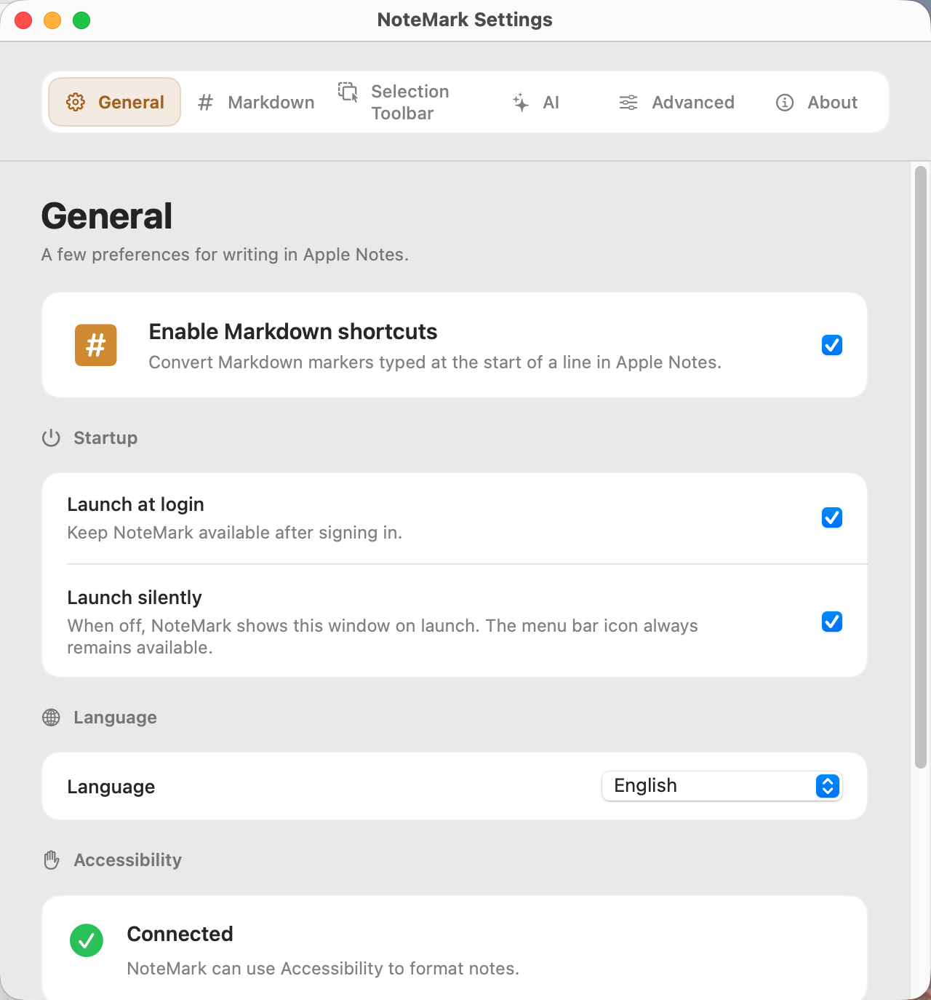
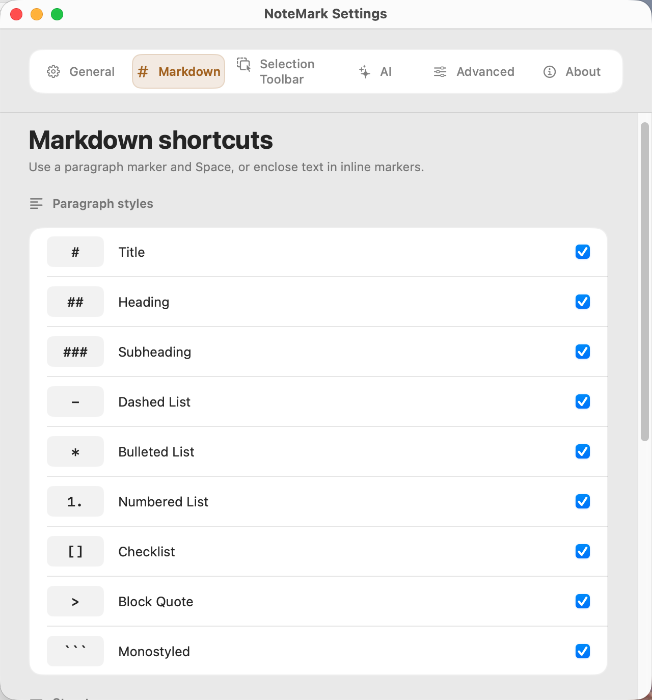
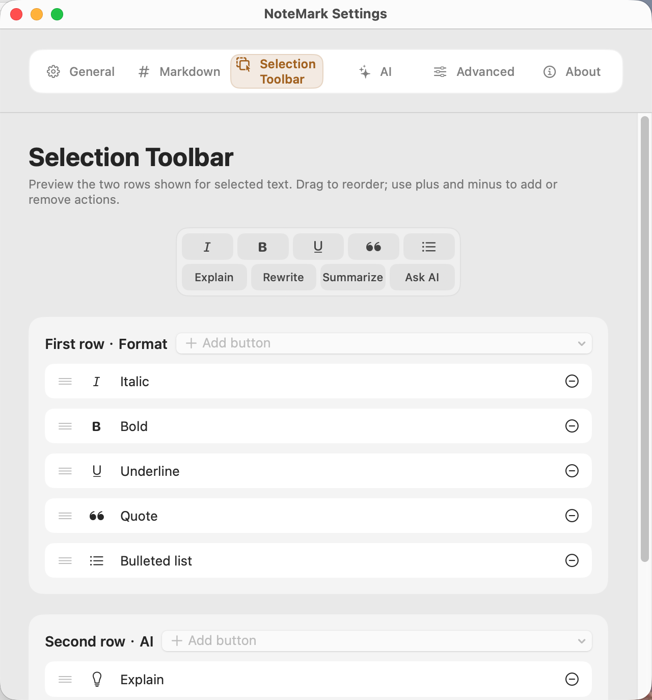
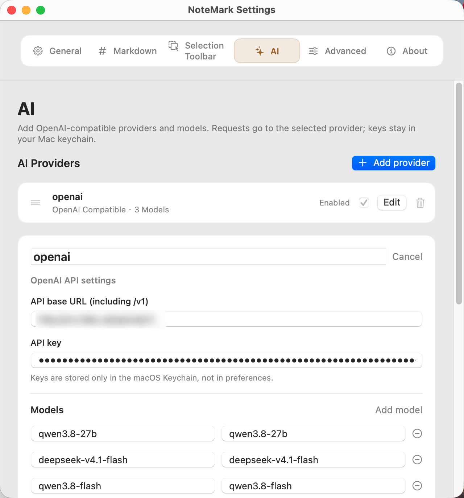
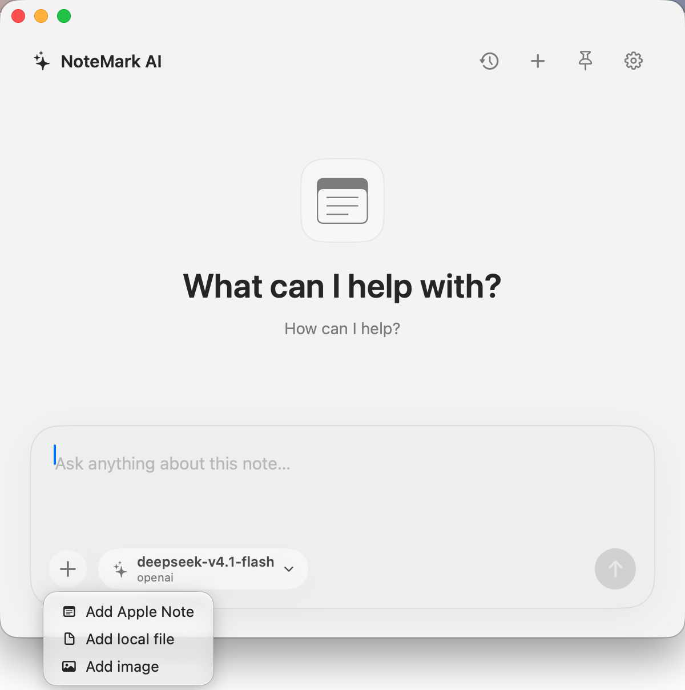
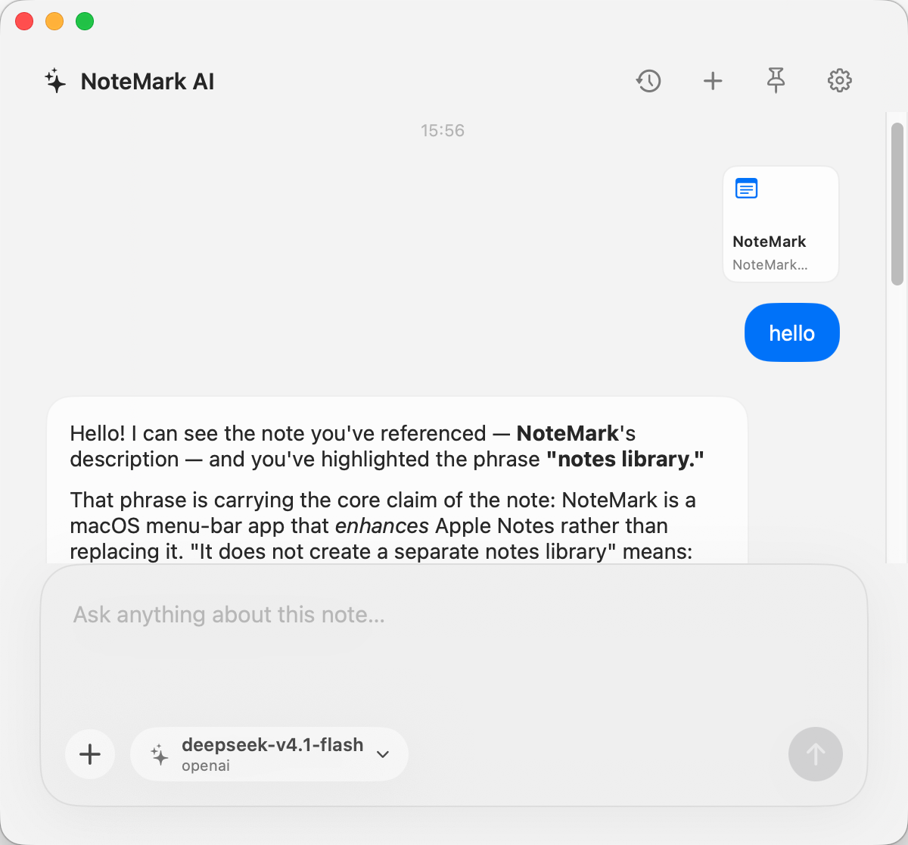
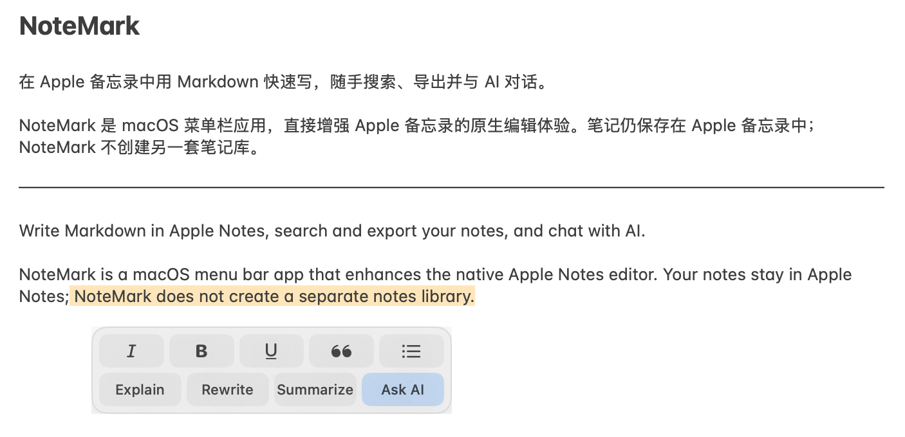
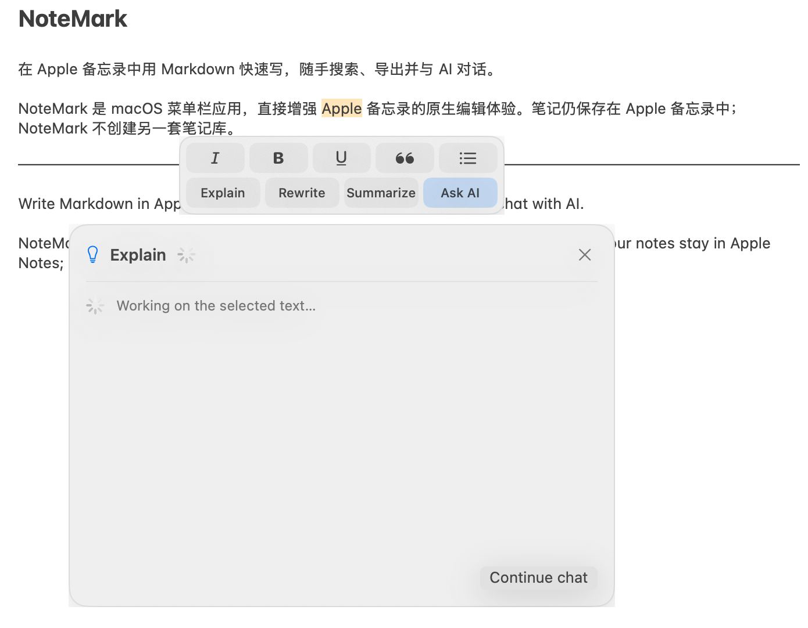

# NoteMark

[简体中文](README.md)

Write Markdown in Apple Notes, search and export your notes, and chat with AI.

NoteMark is a macOS menu bar app that enhances the native Apple Notes editor. Your notes stay in Apple Notes; NoteMark does not create a separate notes library.

## Screenshots

### Settings

| | |
| --- | --- |
|  |  |
|  |  |

### AI chat

| | |
| --- | --- |
|  |  |

### Quick AI actions

Select text to use formatting and AI actions, then view the result in a panel beside your note.

## Download

Download the latest `NoteMark-v*-macOS.zip` from [Releases](https://github.com/XingHehy/NoteMark.app/releases), unzip it, and move `NoteMark.app` to Applications. Requires macOS 14 or later.

On first use, grant NoteMark access in **System Settings → Privacy & Security → Accessibility**. Quick search and opening notes may also prompt for Automation permission.

> v0.1.0 is signed with a local development certificate and has not been notarized by Apple. macOS may block the first launch. Verify that the download came from this repository, then follow [Apple's instructions for opening the app](https://support.apple.com/en-gb/102445).

If macOS says it cannot verify NoteMark.app, try opening it once, then go to **System Settings → Privacy & Security**, scroll down, click **Open Anyway**, and confirm **Open**. This creates an exception for NoteMark without disabling macOS security checks globally.

## Features

- Markdown shortcuts convert headings, lists, checklists, quotes, and separators into native Apple Notes formatting. Bold, italic, and strikethrough are also supported.
- A selection toolbar provides formatting and AI actions such as explain, rewrite, and summarize.
- Press **⌘⇧O** to search notes quickly. A toolbar in the lower right offers an outline, AI, and export.
- Export TXT, Markdown, or PDF. Exported files currently omit images and other attachments from Apple Notes.
- Optional AI chat supports multiple OpenAI-compatible providers, streaming replies, chat history, local attachments, and `@` note references.
- English and Simplified Chinese interfaces, launch at login, and silent startup.

AI API keys are stored in macOS Keychain. Conversations and attachments are stored locally in chat history and sent to the selected provider when you submit a message.

Feedback: [xinghehy@gmail.com](mailto:xinghehy@gmail.com) · [Changelog](CHANGELOG.md)
