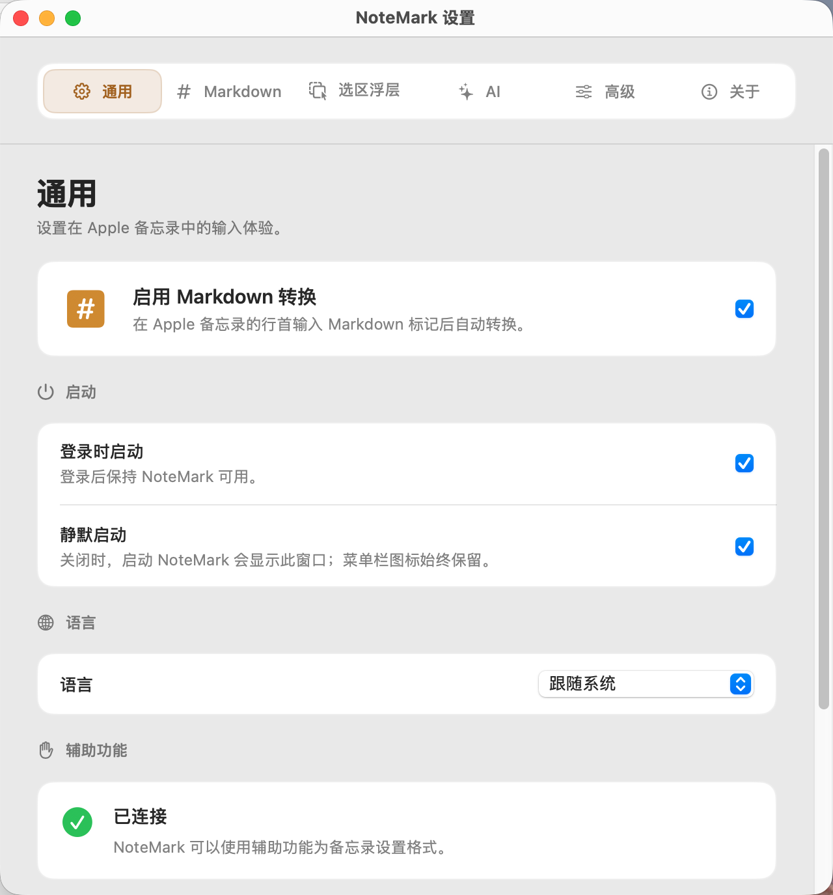
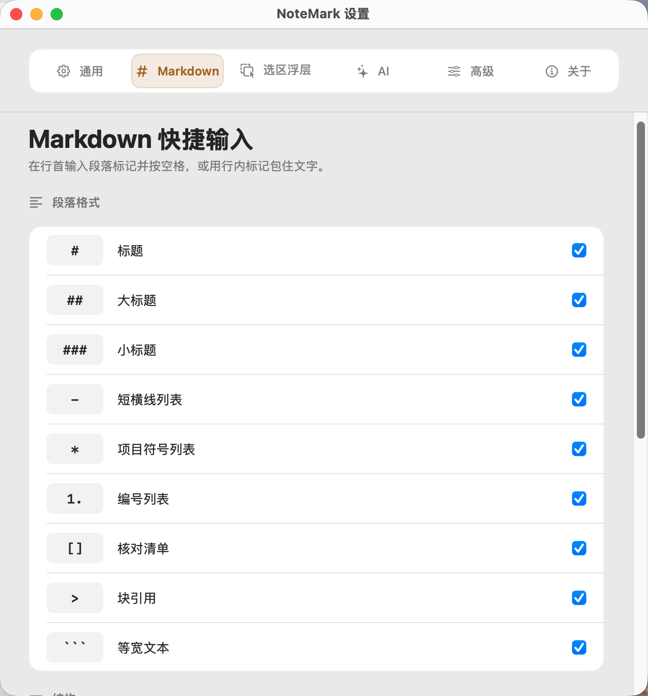
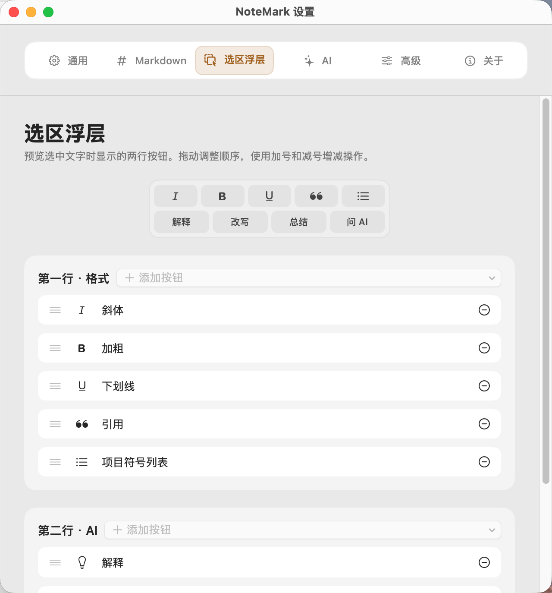
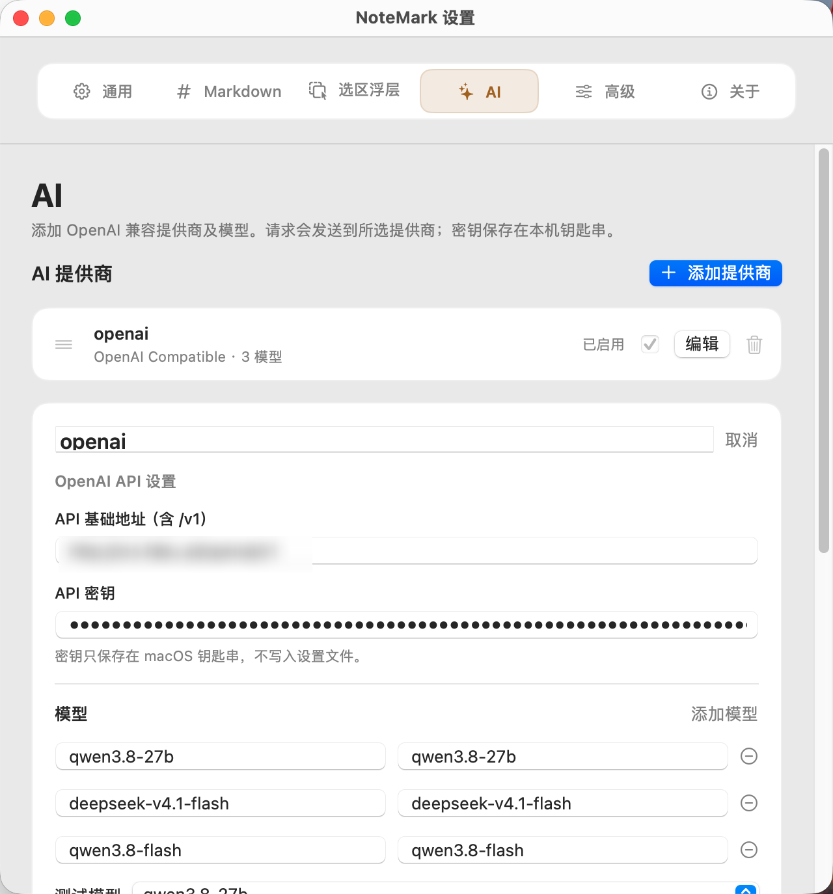
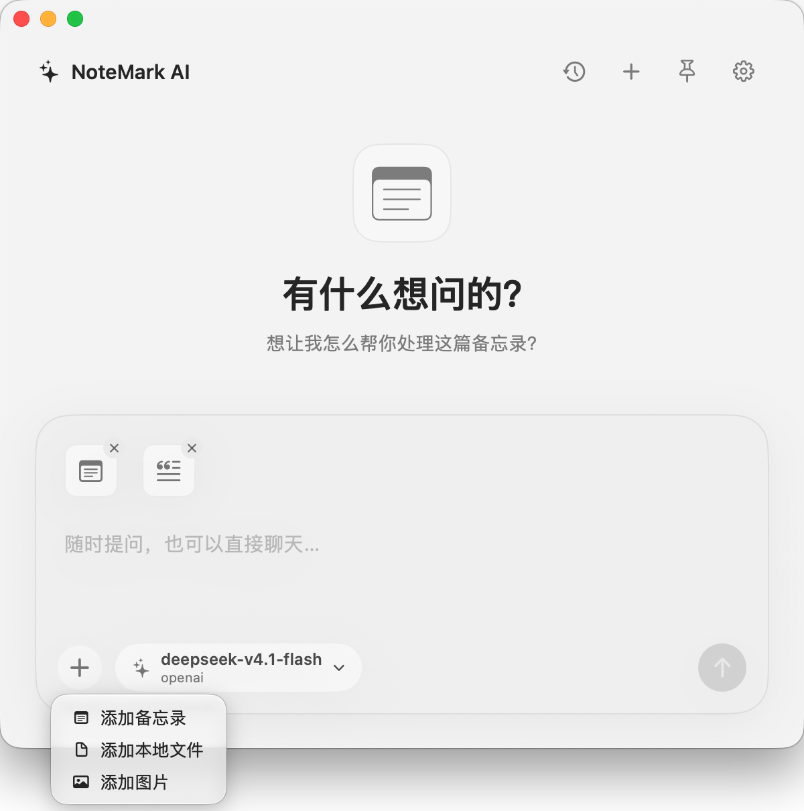
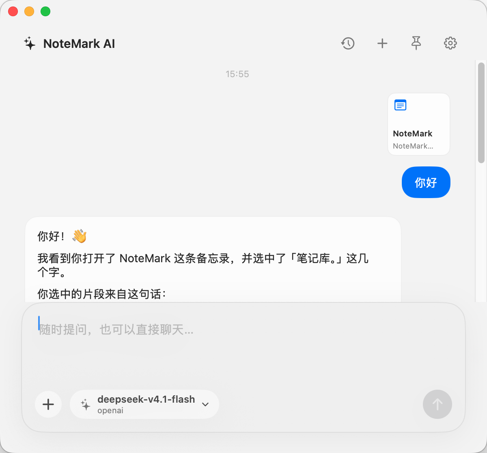
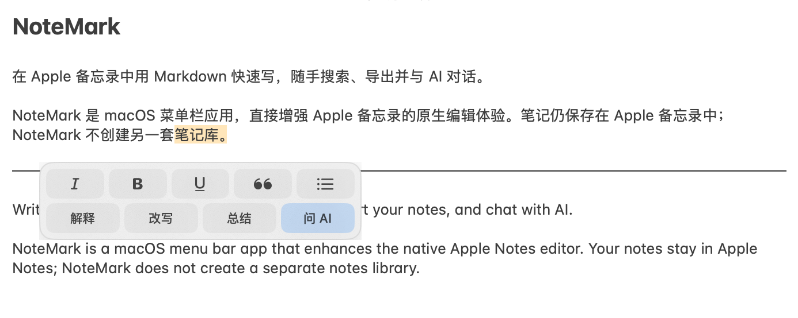
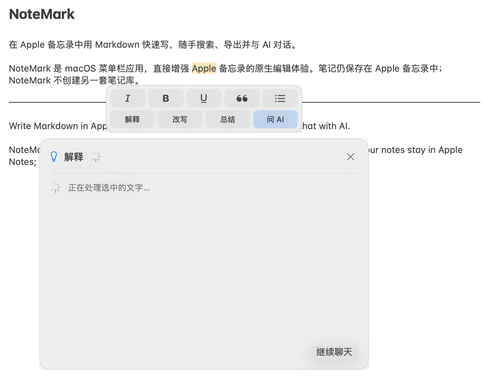

# NoteMark

[English](README-en.md)

在 Apple 备忘录中用 Markdown 快速写，随手搜索、导出并与 AI 对话。

NoteMark 是 macOS 菜单栏应用，直接增强 Apple 备忘录的原生编辑体验。笔记仍保存在 Apple 备忘录中；NoteMark 不创建另一套笔记库。

## 界面预览

### 设置

| | |
| --- | --- |
|  |  |
|  |  |

### AI 聊天

| | |
| --- | --- |
|  |  |

### 快捷 AI 操作

选中文字后可直接使用格式与 AI 操作，并在就地面板中查看结果。

## 下载

前往 [Releases](https://github.com/XingHehy/NoteMark.app/releases) 下载最新的 `NoteMark-v*-macOS.zip`，解压后将 `NoteMark.app` 移到“应用程序”。支持 macOS 14 或更新版本。

首次使用需要在 **系统设置 → 隐私与安全性 → 辅助功能** 中允许 NoteMark。快速搜索和打开备忘录时，系统还会请求“自动化”权限。

> v0.1.0 使用本地自签名证书，尚未进行 Apple 公证。macOS 可能阻止首次打开。请确认文件来自本仓库，再参考 [Apple 的打开说明](https://support.apple.com/en-gb/102445)。

## 主要功能

- 行首 Markdown 快捷输入，转换为 Apple 备忘录原生的标题、列表、核对清单、引用与分割线；支持加粗、斜体和删除线。
- 选中文字后使用格式浮层，或让 AI 解释、改写和总结。
- **⌘⇧O** 快速搜索备忘录；右下角工具栏提供目录、AI 和导出。
- 导出 TXT、Markdown、PDF；导出暂不包含备忘录中的图片或其他附件。
- 可选的 AI 聊天支持多个 OpenAI 兼容提供商、流式回复、历史记录、本地附件及 `@` 引用备忘录。
- 简体中文和英文界面，支持登录时启动与静默启动。

AI API Key 保存在 macOS 钥匙串；发送的对话内容和附件会保存在本机历史中，并在发送消息时传给所选提供商。

反馈：[xinghehy@gmail.com](mailto:xinghehy@gmail.com) · [版本记录](CHANGELOG.md)
